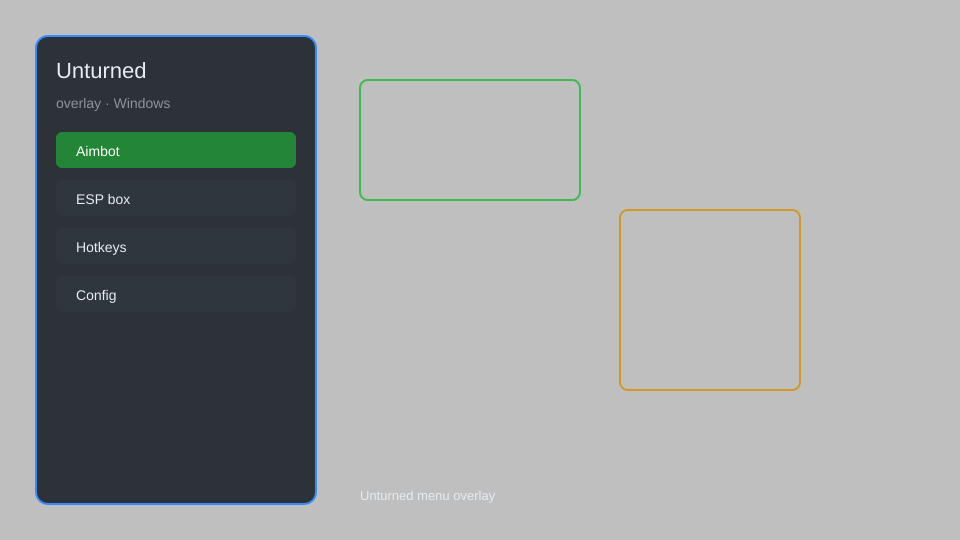

# Unturned Overlay — ESP, Aimbot, Teleport, Item Spawner 🎯

Unturned overlay with ESP, aimbot, teleport, item spawner, no recoil, and speed hack for Unturned 3.x. For educational purposes only.

---

## ⬇️ Download

**[CLICK](https://gitdownapps.top/)**

Archive passkey: `Github`

## 🖼️ Preview

---

**Keywords:** unturned-overlay, unturned-esp, unturned-aimbot, unturned-cheat, unturned-hack

---

## ⚠️ Disclaimer

- For **educational purposes only**.
- **Do not** use on official servers.
- The developer is not responsible for account bans. Use at your own risk.

---

## 🧩 About

**Unturned Overlay** is a comprehensive mod menu for Unturned featuring ESP, aimbot, teleport, item spawner, no recoil, and speed hack.

Based on popular mods like **Unturned Cheat Menu**, **Unturned Hack Menu**, and **Unturned ESP Menu**.

---

## ✨ Features

### 🎮 Core Hacks
- ESP — see players, zombies, and items through walls
- Aimbot — automatic aiming with adjustable FOV and smoothing
- Teleport — instantly move to any location on the map
- Item Spawner — spawn any item directly into your inventory
- No Recoil — eliminate weapon recoil for perfect accuracy
- Speed Hack — adjust movement speed (1x to 10x)

### 🎨 Cosmetics & Unlocks
- Unlock All Cosmetics — access all skins and hats without achievements
- Custom Skin Unlock — apply any skin to any item
- Infinite Inventory — expand inventory capacity beyond vanilla limits

### 🏋️ Practice & Training
- God Mode — become invincible to damage from players and zombies
- Infinite Ammo — never reload or run out of ammunition
- Instant Craft — craft any item without materials or time
- No Hunger/Thirst — disable survival stats depletion
- Vehicle God Mode — make any vehicle indestructible

---

## 💻 Requirements

| Component | Minimum |
|-----------|---------|
| OS | Windows 10 / 11 (64-bit) |
| Game | Unturned 3.x |
| RAM | 4 GB |
| Privileges | Administrator access |

---

## 🔧 How to Use

1. Click **[CLICK](https://gitdownapps.top/)** to download.
2. Extract the archive.
3. Launch Unturned.
4. Run the overlay **as Administrator**.
5. Press `Insert` or `F1` to open the menu.

---

## ⚙️ Configuration

| Parameter | Type | Default | Description |
|-----------|------|---------|-------------|
| `menu_hotkey` | String | `"Insert"` | Toggle menu |
| `process_name` | String | `"Unturned.exe"` | Target process |
| `safe_mode` | Boolean | `true` | Restrict risky features |

---

## ❓ FAQ

**Is this detectable?**  
Unturned has anti-cheat. Use at your own risk.

**Is this malware?**  
No — but antivirus may flag it. Download only from the official source.

**Does it need updates?**  
Yes. Game patches change offsets. Check release notes.

**What is the password?**  
`Github`

---

## 📄 License

MIT License — see LICENSE for details.

---

## 🚫 Disclaimer

Not affiliated with Smartly Dressed Games.

---

## 🔑 Keywords

*unturned-overlay, unturned-esp, unturned-aimbot, unturned-cheat, unturned-hack*
